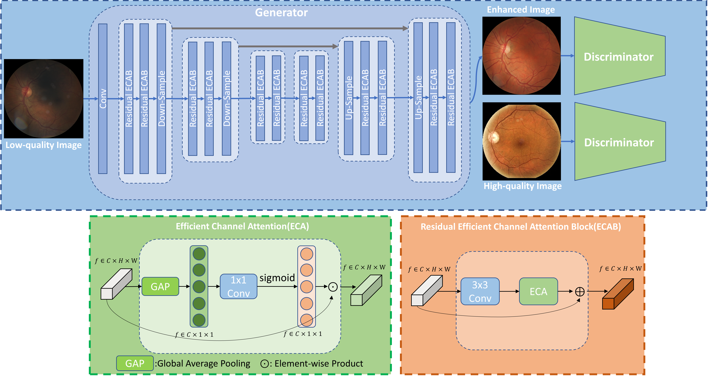
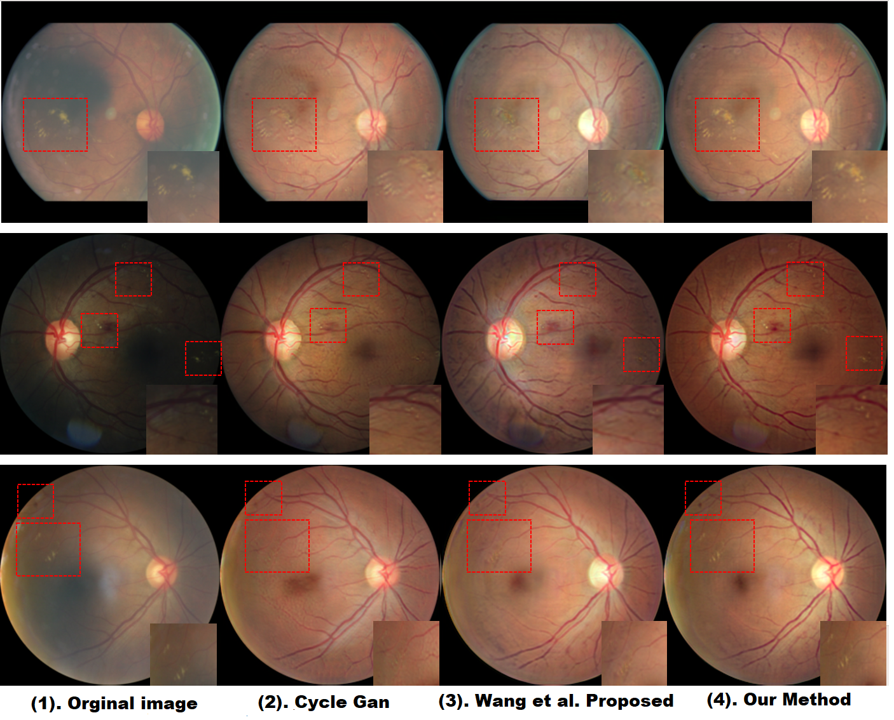

# OTE-GAN

Code for the paper [ISBI '2023] [Optimal Transport Guided Unsupervised Learning for Enhancin Low-Quality Retinal Images](https://arxiv.org/pdf/2302.02991.pdf)

Here is latest work for OT retinal denoising 
### [IPMI '2023] [OTRE: Where Optimal Transport Guided Unpaired Image-to-Image Translation Meets Regularization by Enhancing](https://arxiv.org/pdf/2302.03003.pdf)) With [Github](https://github.com/Retinal-Research/OTRE)

## Visual Results

  ## License

  Released under the [ASU GitHub Project License](https://github.com/Retinotopy-mapping-Research/DRRM/blob/master/LICENSE.txt).
